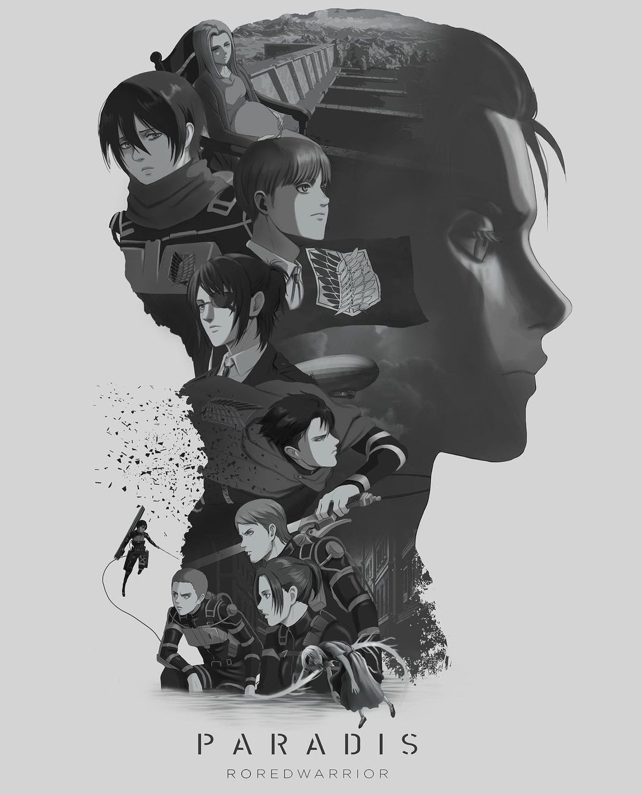

<!-- HEADINGS -->

# my title
## my title h2
### my title h3
#### my title h4
##### my title h5
###### my title h6

<!-- italic -->
this is an *italic* text

<!-- strong -->
this is an **strong** text

<!-- strikethrough -->
este es un ~~texto~~ tachado


<!-- UL -->
* apple
    * apple 2
* orange
    * nfuwnre
* etc

1. apple
    <!--1. apple 2-->
2. orange
3. etc

[wikifandomVOCALOID](https://vocaloid.fandom.com/wiki/Vocaloid_Wiki)

[wikifandomVOCALOID](https://vocaloid.fandom.com/wiki/Vocaloid_Wiki "Custom title")

> this is a quote<!-- cita -->

<!-- lineas -->
---
___


`console.log('hello world')`

```java
public class JavaChevere {
    public static void main(String[] args) {
	System.out.println("");
	System.out.println("Que chevere es programar Java en Windows!");
	System.out.println("");
        System.out.println("	\\o/	\\o/	\\o/	");
        System.out.println("	 |	 |	 |	");
        System.out.println("	/ \\	/ \\	/ \\	");
	System.out.println("");
    }
}
```

```python
print("hello world")
```

```html
<h1>helloworld</h1>>
```

| Tables        | Are           | Cool  |
| ------------- |:-------------:| -----:|
| col 3 is      | right-aligned | $1600 |
| col 2 is      | centered      |   $12 |
| zebra stripes | are neat      |    $1 |

<!--|ahfyafe    |uasdhfu  |
|-----------|---------|
| jehcuh    |   effff |-->

<!-- simbolo de admiracion para que no reconozca esto como un enlace si no mas bien como una imagen -->





<!-- GITHUB MARKDOWN -->

<!-- tareas, cuadrito de check, no se ve aqui en visual studio code por que son reglas propias de github. pero alli si que se veran -->
* [x] Task 1
* [ ] Task 2
* [ ] Task 3
* [x] Task 4

@maria-arcila82221 :whale2: :snail:

[](http://www.youtube.com/watch?v=QLO-ZD8_5Yk)


